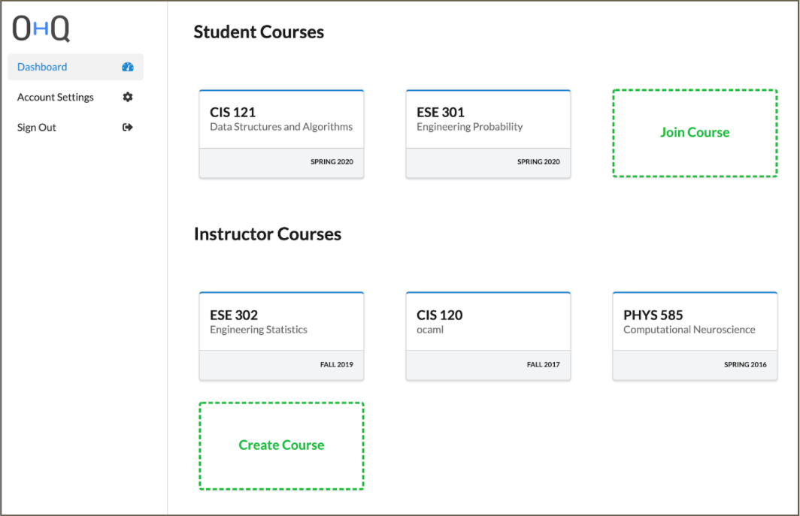
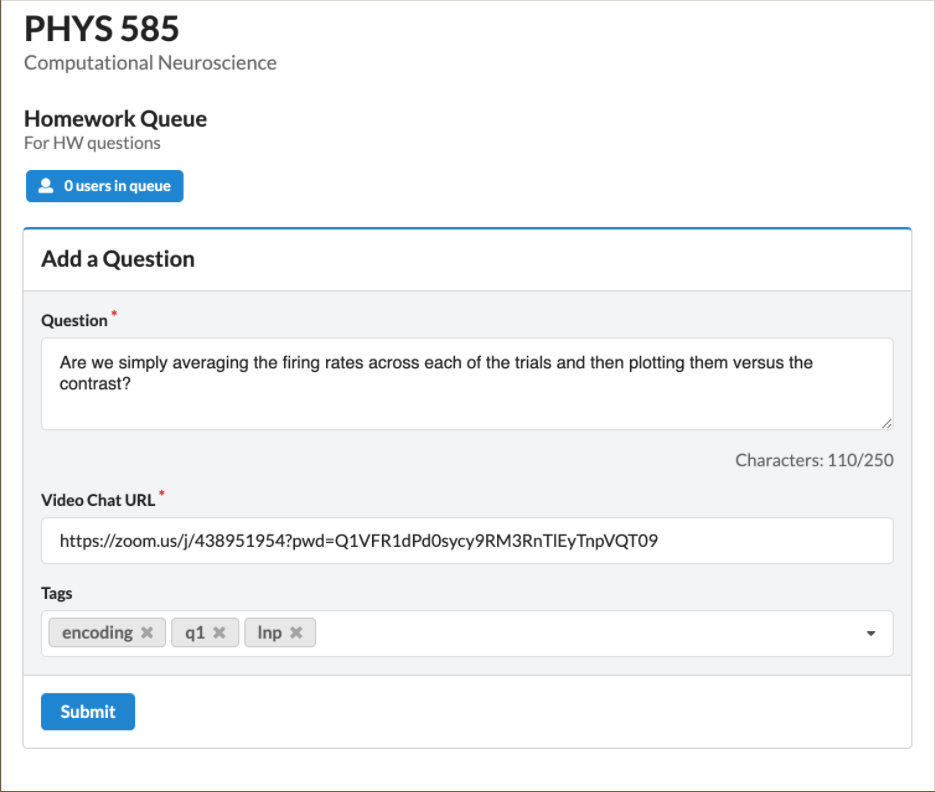
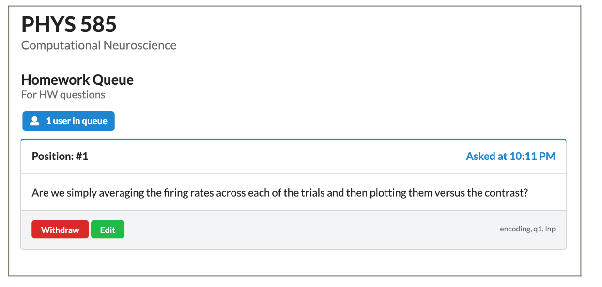

# Tech Spotlight: Waitwhile

## What is Waitwhile?

The OHQ queue management system is what many Penn Engineering Online courses use to hold Drop In Private Office Hours. It allows students to wait in a virtual line rather than a physical line to meet with the instructor or TA. When students have questions, they can add themselves to open queues and check their position in line. Instructors can then view the submitted questions and meet with students when they are ready.

Upon joining the queue, students will provide a question and a link to a video conferencing tool, such as Zoom. Once they reach the front of the queue, the instructor will join the video conferencing link provided by the student.

---

## OHQ Dashboard

In your OHQ Dashboard, you can see courses you've already joined, or self-enroll in non-invite only courses. You will need to self enroll in the OHQ course by following the link on the course resources page. Please note that not all courses use OHQ, so please read the syllabus and Getting Started Lesson to see what office hours system each course uses.

---

## Joining and Waiting in Queue

You can access the *Queues* tab within a course and can see how many students are currently in that queue. Students may only join one queue at a time.

While you are waiting in the queue, you must keep your video chat open (but your video can be off) so the TA or instructor can join as soon as you are at the front of the queue. While you are waiting, you can see what position you are in, and you are also allowed to edit your question even after it was submitted. If you no longer need help, you may withdraw your question.

---

## Notifications

OHQ will notify you when you are close to the top of the queue. You can enable/disable SMS notifications through *Account Settings*.

---

**Next:** [Guidelines for the Use of Generative AI in your Program](03-guidelines-for-generative-ai.md)
