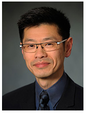

# Meet the MSE-DS Online Program Director

## James C. Gee

**Director, MSE-DS Online Degree Program**
School of Engineering and Applied Science, University of Pennsylvania, Philadelphia, PA

---

## Professional Roles and Responsibilities

- **Professor of Radiologic Science** in Radiology
- **Director**, Penn Image Computing and Science Laboratory, Department of Radiology, Perelman School of Medicine, University of Pennsylvania, Philadelphia, PA
- **Co-Director**, Translational Biomedical Imaging Center, Institute of Translational Medicine and Therapeutics, University of Pennsylvania, Philadelphia, PA
- **Director**, Interfaces Program in Biomedical Imaging and Informational Sciences, University of Pennsylvania, Philadelphia, PA

---

## About Dr. Gee

Dr. Gee has been a key member of the MSE-DS Online program. In his role as your director, Dr. Gee works closely with our outstanding online learning team to enhance the learning experiences and sense of belonging among our MSE-DS Online community.

Dr. Gee grew up speaking the Queen's English, after being born and raised in West Africa. Following a boarding school stint in the UK, he moved to the US to continue his studies and, sadly, lost his British accent. He enjoys food, fashion, and the arts, and currently has on heavy rotation music by Angel Olsen, Tears for Fears, and Charlie Haden.

---

## Key Points

- Dr. James Gee leads the MSE-DS Online program with a focus on student success and community building
- His expertise spans radiologic science, biomedical imaging, and computational science
- He brings interdisciplinary experience and a commitment to translating research into practical applications
- Dr. Gee is dedicated to supporting your learning journey and fostering a strong online community

---

**Next:** [Module 2: Academics and Course Selection](../Module%202/index.md)
