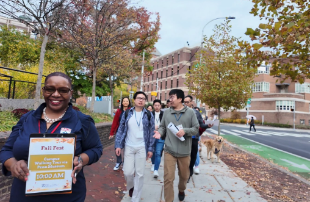
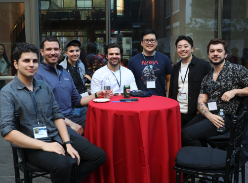

# MSE-DS Engagement Opportunities

To follow all events and community programming throughout the year, please subscribe to the [MSE-DS Online program calendar](https://calendar.google.com/calendar/u/0?cid=Y19kZGVkODYxZjc4NTRiOGYzMDg3YmQ2Y2YxMWI3ZjZiZTE2ZTRkZjdhNmQzNjgxYTM0MmU2ZTFkMjA2MzRjMjI4QGdyb3VwLmNhbGVuZGFyLmdvb2dsZS5jb20) and keep a lookout in the #announcements channel in your Slack workspace.

---

## Slack

Slack is our largest hub for community engagement and real-time communication with your peers. Now that you have learned more about Slack and joined the workspace, we highly encourage you to stay actively involved and add yourself to channels to get to know your new classmates. They want to meet you! If a channel you are looking for does not exist, we encourage you to make your own!

---

## Meet-Ups

Students will casually coordinate meet-ups like ski trips, picnics, or dinners all over the world. Keep an eye out within your Slack community, and you may find yourself meeting some of your peers in person!

Additionally, the Penn Engineering Online team will coordinate more formal in-person meet-ups. For example, our Career Development team plans 2-3 [Road Trips](https://online.seas.upenn.edu/tag/road-trip/) each year, where we travel to different cities and provide students with the opportunity to visit top tech employers, such as Google, Amazon, and Meta, and host networking events with local students and alumni.

---

## Homecoming Powered by Penn Engineering

Join more than 200 Penn Engineering Online students and alumni on campus at Homecoming! This annual event includes opportunities to explore the highlights of Penn's campus in addition to a program full of presentations led by faculty. These presentations cover a wide range of topics, from faculty research to innovations in computer science. Homecoming is an opportunity to forge new relationships and strengthen existing camaraderie. For many attendees, this is often the first time they are meeting face to face with classmates and faculty who they interact with through our vibrant online learning network.

---

## Semester Events

Penn Engineering Online offers virtual events during each semester to network with one another, learn more about the tech industry, help you prepare for your career, and more! Listed below are some of the types of programming you can expect to see once you begin your studies:

- Resume and cover letter workshops
- Technical interview prep workshops
- Industry chats with industry professionals
- Career spotlights (i.e. learning from students and alumni who are Project Managers)
- New elective webinars hosted by faculty
- Q&As with Penn Engineering Online students, faculty, and staff
- Social & networking events like bingo, trivia, and virtual hangouts

---

## LinkedIn

Expand your network! Connect with your fellow classmates by [joining our private LinkedIn group](https://www.linkedin.com/groups/12146201/) for admitted students. This is a great opportunity to network with your fellow classmates in the industry and an even better opportunity to stay connected after graduation.

Students can also post job opportunities with the companies they work for and recommend their Penn Engineering Online peers to apply. We love when our students help hire other students!

---

## Leadership and Support Opportunities

### Teaching and Learning Practicum (TLP)

The Teaching and Learning Practicum (TLP) provides high-performing Penn Engineering Online students the opportunity to gain additional skills in their field through practicing educational leadership and mentoring. The TLP program combines formal training with practical experience leading to a Teaching Practicum course on their transcript. TLPs will be required to attend the practicum portion of their coursework for 15 hours per week.

[Learn more about TLP](https://online.seas.upenn.edu/degrees/get-involved/teaching-and-learning-practicum/)

### Teaching Assistants (TA)

Teaching assistants guide Penn Engineering Online students to academic success by helping them engage with and understand the course materials. TAs will serve as one of the primary sources of knowledge and expertise for our students. Penn Engineering Online faculty, staff, and head TAs support the teaching assistants in establishing and maintaining these working relationships.

[Learn more about TA positions](https://online.seas.upenn.edu/degrees/get-involved/teaching-assistants/)

### Academic Coaches (AC)

Academic Coaches provide tutoring and coaching services throughout each week by:

- Hosting regular weekly open and private office hours for students to attend
- Working with students one-on-one to mediate work/life issues they may encounter during the semester, such as adjusting back to school, time management, good study habits, challenges in introductory courses, etc.
- Hosting information sessions for groups of students on topics important for student success
- Covering flexible topics ranging from student tools and platforms, strategies for student success, and academic concepts

---

## Campus Cultural Centers

Find community outside of Penn Engineering Online by getting involved with the [cultural centers](https://global.upenn.edu/isss/cultural-resources) below. Though the centers are housed on campus, they offer virtual events for online students to join and be a part of their community.

**[The Lesbian Gay Bisexual Transgender Center](https://lgbtcenter.universitylife.upenn.edu/)**  
A home for LGBTQ+ people and their allies at Penn.

**[The Pan-Asian American Community House](https://paach.universitylife.upenn.edu/)**  
A cultural resource center at Penn where South Asian, East Asian, Southeast Asian, and Pacific Islander cultures are celebrated.

**[The Center for Hispanic Excellence: La Casa Latina](https://lacasa.universitylife.upenn.edu/)**  
Promotes greater awareness of Latino issues, culture, and identity at Penn.

**[The Albert M. Greenfield Intercultural Center](https://gic.universitylife.upenn.edu/)**  
Penn's resource for enhancing students' intercultural knowledge, competency, and leadership through programs, advising, and advocacy.

**[Makuu: The Black Cultural Center](https://makuu.universitylife.upenn.edu/)**  
The University of Pennsylvania's focal point for student activities, ideas, outreach, and support linked to Black culture and the African Diaspora.

**[Penn Women's Center](https://pwc.universitylife.upenn.edu/)**  
Plays an advocacy role regarding issues of gender, health, childcare, workplace discrimination, domestic and sexual violence, and mental health.

---

## Key Points

- Stay connected: Subscribe to the program calendar and monitor Slack announcements
- Slack is the primary hub for peer communication and community building
- Multiple networking opportunities: casual meet-ups, formal Road Trips, and Homecoming events
- Semester programming covers career development, technical preparation, and social networking
- LinkedIn group provides ongoing professional networking and job opportunities
- Leadership opportunities available (TLP, TA, AC positions) to develop skills and support peers
- Cultural centers offer inclusive spaces and programming for all students, including virtual events for online learners
- Balance community engagement with your academic and professional commitments

---

**Next:** [Module 2: Academics and Course Selection](../Module%202/index.md)
