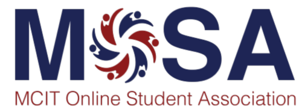

# MCIT Online Student Association (MOSA)

The MCIT Online Student Association (MOSA) is the first and only dedicated student organization for the Master of Computer and Information Technology/Master of Applied Science in Computer Science online program.

---

## Mission and Goals

MOSA's goal is to develop and foster the MCIT online student community with programs and events related to:

- **Education & Learning** - Academic support and skill development
- **Entrepreneurship & Jobs** - Career growth and professional opportunities
- **Community & Belonging** - Building connections and fostering community

MOSA aims to support and empower the student community to take advantage of University of Pennsylvania resources by liaising amongst the student body, university administration, and faculty.

---

## How to Get Involved

### Learn More

[Visit the MOSA website](https://mosa.seas.upenn.edu/) to learn more about their programs, events, and resources!

### Share Your Feedback

The association is always happy to hear from you. Please feel free to [share how you would like to engage](https://mosa.seas.upenn.edu/share-your-thoughts/).

### Join MOSA

To participate in activities organized by MOSA and receive the MOSA newsletter, you must officially [register as a member](https://mosa.seas.upenn.edu/join-mosa/).

---

## Key Points

- MOSA is a dedicated student organization supporting online computer science students
- Programs focus on education, entrepreneurship, jobs, and community building
- MOSA serves as a bridge between students, faculty, and university administration
- Membership is free and easy—register on the MOSA website
- Active engagement in MOSA enhances your overall student experience and network
- Your feedback and ideas for events are valued and encouraged

---

**Next:** [Module 2: Academics and Course Selection](../Module%202/index.md)
