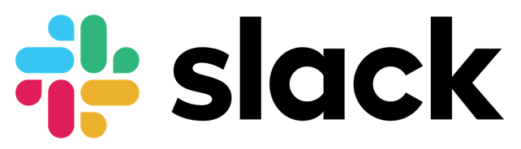
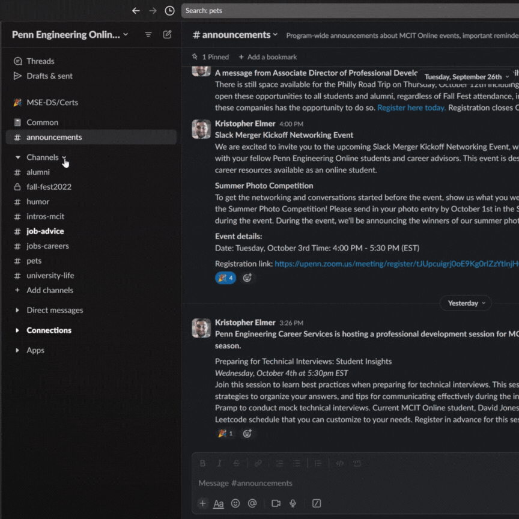
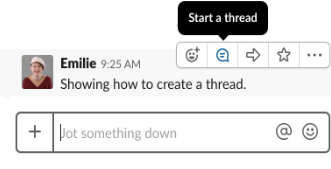
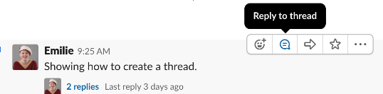
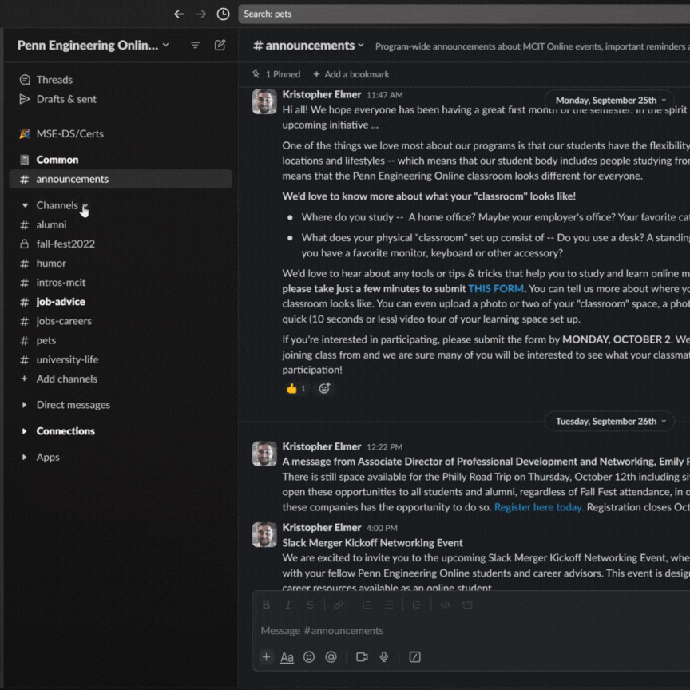

# Tech Spotlight: Slack

Slack is a cloud-based instant messaging and collaboration system. You can think of it as a chat room that offers features and functionalities beyond what a chat room traditionally does. Slack allows you to join and create channels to organize your group conversations. You can also send instant and direct messages to one person instead of a group. In summary, Slack is a synchronous communication tool where you can chat with your classmates in real-time.

---

## Setting Up Your Slack Account

1. Look out for an email in your Penn email inbox with a unique link for you to register yourself for the Slack workspace using your Penn email address.
2. **Important:** This link expires after 30 days, so register yourself immediately!
3. If you have any trouble setting up your Slack account, please [email the Student Success team](https://online.seas.upenn.edu/student-knowledge-base/connect-with-student-support/)

---

## How Slack is Used in the Program

Slack is a tool for you to get to know your peers and build community! Here are just a few of the many benefits of Slack:

- **Community building** - Connect with classmates beyond coursework
- **Collaborative learning** - Share knowledge and resources with peers
- **Effective communication** - Real-time messaging with individuals and groups
- **Huddles and Video collaboration** - Face-to-face interactions online
- **Customization** - Organize channels by topic and interest
- **File sharing/Secure data storage** - Share documents and resources securely

---

## Program-Wide Channels

We have already created and added you to the following program-wide Slack channels:

**#announcements**  
Program-wide announcements about Penn Engineering Online events, important reminders about course registration, etc.

**#community**  
You are encouraged to post interesting articles, events, job postings, etc. related to computer science and technology. This channel is meant to create community for everyone at Penn Engineering Online. Please refer to Penn Engineering Online's Community Guidelines and the University's [Code of Conduct](https://catalog.upenn.edu/pennbook/code-of-student-conduct/) for student expectations while participating in Slack.

---

## Program-Specific Channels

Announcements and events related only to your program will be posted in the program channels:

- #mcit-online
- #mas-cs-online
- #mse-ds-online
- #mse-ai-online
- #mse-ssc-online
- #certs

Students can participate in program-specific discussions here. **Be sure to join your program channel!**

---

## Course Channels

Each degree course has a public channel in Slack that you can join to chat in real-time with all your classmates. Students can have access to each course's Slack Channel on the left menu in Canvas once the course is published in Canvas.

---

## Other Slack Channels to Check Out

- **#philly, etc.** - Regional groups to connect with people who live near you
- **#mosa-jobs-careers** - Forum to discuss career plans, ideas, job openings, and career support
- **#support** - Moral support for when you're feeling down about class
- **#women-in-tech** - A space to share resources for women to thrive in tech industry
- **#newtocoding** - Share programming tips and tricks
- **#have-kids-will-code** - A place to meet other parents in Penn Engineering Online
- **#course-planning-advice** - Peer advice as you're deciding what to take next semester

### How to Join Channels

1. Click "Channels" on the left-hand sidebar
2. Click "Manage"
3. Click "Browse Channels"
4. Search for the channel you want to join
5. Click the green "Join" button

---

## Slack Etiquette

**Use Reply to Thread**  
If you are replying to someone about a particular topic in Slack, please use the "Reply to thread" feature. Creating a thread, instead of creating a new message in the main channel, helps the channel stay more organized by topic/question and helps other students focus on what is relevant to them.

**Use @channel and @everyone Sparingly**  
Only use the @channel or @everyone feature sparingly since it will send a notification to all students in the channel.

**Course Staff Communication**  
Note that course staff will not be available to respond to private messages via Slack as this tool is primarily meant for peer-to-peer communication.

**Academic Integrity**  
Do not share solutions in the Slack channels even after solutions have been posted in the courses. This is considered a violation of academic integrity and may be subject to disciplinary action.

---

## Create New Channels

You can create your own channels for topics or interests not already covered! 

1. Click the plus icon next to "Channels" on the left-hand sidebar
2. Click "Create Channel"

---

## Key Points

- Slack is your primary tool for peer-to-peer communication and community building
- Register immediately using the invite link sent to your Penn email (expires in 30 days)
- Join program-wide channels (#announcements, #community) and your program-specific channel
- Use thread replies to keep channels organized and discussions focused
- Don't share course solutions in Slack—this violates academic integrity
- Create new channels for topics or interests relevant to you and your cohort
- Slack supports both synchronous (real-time chat) and asynchronous communication
- Regional groups and special interest channels help build broader connections

---

**Next:** [Module 2: Academics and Course Selection](../Module%202/index.md)
