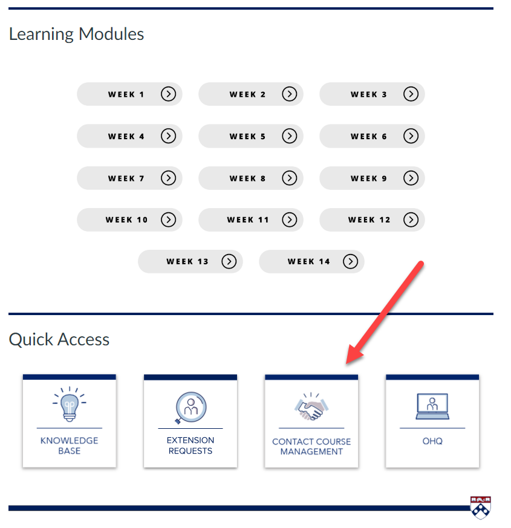

# Course-Level and Technical Support

## Course-Level Support - from TAs and Instructors

- **"Contact Course Management" button** on all of your Canvas course homepages. This button will take you to a form that will route your request directly to the course staff for your course. You can use this form for all requests related to the technology for the course, course logistics, or anything else you need to reach your course staff about.

- **Ed Discussion Forums** - Our course staff is here to support your learning. If you have any academic questions about the content covered in a course, please post them in the class Ed Discussion Forum. Instructors and Teaching Assistants (TAs) will do their best to get back to you within 24 hours. By posting in the forum, you are also letting other students benefit from the response. You may also directly message your TAs and course staff with any private, more personal matters.

- **Office Hours** (See the "Course Experience" in the Academics and Course Selection module).

- **Email** - For private course-related questions such as regrade requests, send an email to the [student support team](https://online.seas.upenn.edu/student-knowledge-base/connect-with-student-support/) and it will be routed to the correct course team. Please include your Penn ID number in all email correspondence with the program and university.

**⚠️ *Please do NOT send any requests directly to the university email addresses of TAs or instructors. Slack is also not an appropriate medium to send any communications to TAs or instructors. Use the infrastructure outlined above.***

---

## Technical Support

- **Canvas platform:** If you have a non-urgent technical issue in Canvas, please click here to view the [Canvas Student Guides](https://community.canvaslms.com/t5/Canvas-Student/ct-p/canvas_student).

- **Slack, Zoom, Honorlock:** For any questions about the app itself, contact Slack, Zoom, or Honorlock Support directly.

- **[CETS](https://cets.seas.upenn.edu/contact-us/)** - [PennKey](https://isc.upenn.edu/pennkey), two factor authentication, and SEAS email support.

---

**Next:** [Student Advising Support](03-student-advising-support.md)
